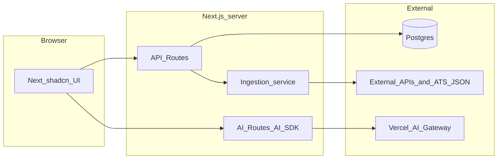

# Job search application (multi-type roles, favorites, hide)

## Context

The workspace [`/Users/erikholmberg/Development/searcher`](/Users/erikholmberg/Development/searcher) is **empty**, so this is a greenfield build. You chose **accounts + server database** for favorites/hidden state, and **job data from public APIs plus user-entered career pages**.

## Product behavior (locked in)

- **Role types**: Named buckets the user creates (e.g. “Staff backend,” “ML infra”). Each type has one or more **search configurations** (keywords, location, remote filter) and/or **source URLs** (company career / ATS pages).
- **Lists**: Jobs appear **under the role type** that produced them; the same external job can appear under multiple types if it matches several searches (dedupe per type by stable job id).
- **Hide**: User marks a job hidden; it disappears from lists (and stays hidden across sessions).
- **Favorite**: Favorited jobs **sort to the top** within that role type’s list (or globally per type—default: **within each type’s list**).
- **Create from job URL (AI)**: Alternative to manual entry—user pastes **one supported job posting URL**; the server fetches structured posting data where possible, then **AI (Gateway, `generateObject`)** proposes **`name`**, **`intent`**, and initial **`RoleTypeSource`** suggestions (aggregator keywords/location/remote filter and/or ATS board hints). User reviews and edits in a preview step before saving (nothing persisted until confirm).
- **Find more jobs**: On a **role type** view, a **Find more** button runs another fetch for that type’s sources using **stored pagination** (next page / offset / cursor per provider), then **appends only jobs not already** linked to that role type (dedupe by **`JobListing.externalId`** within `RoleTypeJob` for that `roleTypeId`). UI shows how many **new** rows were added and a **No more results** (or **Nothing new**) state when the next fetch returns no unseen jobs or the provider has no further pages.

### User-entered data for a role type

Think of input as two layers: **the bucket** (`RoleType`) and **how to fill it** (`RoleTypeSource` rows).

**Ways to start a role type**

1. **Manual** — User fills **name** (and optional **intent**) and adds one or more **sources** as below.
2. **From job URL** — User provides only a **posting URL** first; after AI proposal, the same fields apply and remain **fully editable** before create.

**On the role type itself (always)**

- **Name** — Short label shown in the UI (e.g. “Staff backend,” “ML infra”).
- **Sort order** — Optional; controls order of buckets in the sidebar or tabs.

**Optional on the role type (recommended once AI scoring / “why fit” exists)**

- **Intent / description** — One free-text field in the user’s own words: what “similar” means for *this* bucket (seniority, stack, domain, work style). Used for AI assist, match explanations, and structured scoring. Distinct from raw API keyword strings (those live on sources below). If omitted, fall back to **name** + aggregated source keywords for AI context. When created **from job URL**, AI pre-fills this from the posting; user may shorten or rewrite.

**Per source attached to that role type (one type can have many sources)**

- **Aggregator / public API query** — Fields the provider needs, e.g. **keywords** (title/body search), **location** (city/region or “remote”), **country** where applicable, **remote-only** or work-mode filter if the API supports it, optional **max results** cap.
- **Company career / ATS** — **Paste URL** (careers page or known board URL) or enter **board token / site slug** (e.g. Greenhouse board name, Lever company slug); optional **extra filter keywords** to narrow jobs after fetch.

The user does **not** need to enter both an API query and a career URL for a given type—they can mix sources (e.g. one Adzuna query + two Greenhouse boards) under the same **name** bucket.

### Create role type from job URL (server + AI flow)

1. **Client** — User pastes a **single job posting URL** and chooses “Suggest role type with AI.”
2. **Server: resolve + fetch (SSRF-safe)** — Parse URL against **allowlisted hosts** (same policy as ATS fetchers). Resolve to **structured JSON** for that job where supported (Greenhouse/Lever/Ashby patterns first). Unsupported URLs return a **clear error** (no open proxy to arbitrary domains).
3. **Normalize posting** — Map response into the same shape used elsewhere: title, company, canonical apply URL, snippet, `locationDisplay`, `workMode` (reuse provider mappers).
4. **AI via Vercel AI Gateway** — `generateObject` + Zod on a **compact text bundle** derived from structured fields (not raw HTML): propose **`name`**, **`intent`** (“find similar roles to this one …”), **`aggregatorKeywords`**, **`location`**, **`remoteOnly`**, and optionally **`atsBoardUrlOrToken`** **only when** inferable from the pasted URL (do not invent boards or URLs).
5. **Preview UI** — Show posting summary + editable proposed fields and proposed sources; user edits, then **Confirm** to create `RoleType` + `RoleTypeSource` rows (same as manual path). Optional: **upsert seed job** into `JobListing` and attach to the new type so the inspiration role appears immediately.

**Rate limits** — Per-user throttle on this endpoint (AI + fetch cost); log model version used for proposals.

## AI (Vercel AI Gateway)

**Rule:** Any feature that calls an LLM (text generation, classification, streaming chat, optional embeddings if exposed via gateway) **must** go through **[Vercel AI Gateway](https://vercel.com/docs/ai-gateway)** using the **[Vercel AI SDK](https://ai-sdk.dev/)** (`ai`, and `@ai-sdk/react` where needed on the client). Do **not** add direct OpenAI/Anthropic/etc. API clients for app features; use gateway-backed models (e.g. provider string IDs like `openai/gpt-4.1-mini` per [gateway models](https://vercel.com/docs/ai-gateway/models-and-providers)) so keys, routing, and observability stay centralized.

**Likely AI touchpoints (implement as needed; all via Gateway):**

- **Role-type assist**: Turn a short user phrase into suggested keywords, boolean search strings, or a short “ideal role” description used for ranking copy.
- **Create role type from job URL**: After structured fetch of one posting, use **`generateObject`** (Gateway) to propose `RoleType` **name**, **intent**, and initial **source** configs; user confirms before persist (see dedicated subsection under product behavior).
- **Match / explain**: Given a `RoleType` description + job title/snippet, stream a one-paragraph “why this might fit” or a discrete relevance score used to sort within the type.
- **Later**: Semantic dedupe or re-ranking across large result sets using structured model output (`generateObject` / Zod) rather than ad-hoc parsing.

### AI opportunities (accuracy vs. functionality)

Use the gateway for all of the below; **prefer `generateObject` + Zod** when the output drives sorting, filters, or dedupe (numeric scores, enums, tags). Use **streaming `streamText`** for user-facing prose where occasional imprecision is acceptable.

**Accuracy (better recall, precision, and data hygiene)**

- **Query and source expansion**: From a short role-type description, propose synonym sets, related titles, and alternate search strings (and optional extra ATS query tokens) to widen recall without manual keyword tuning.
- **Structured relevance scoring**: For each `(RoleType, JobListing)` pair, produce a calibrated score plus short rationale; sort within the type by `favorite` → **score** → `postedAt`. Cache scores in `RoleTypeJob.matchScore` (keyed by model/version) to control cost and latency.
- **Normalization for dedupe**: Canonicalize company names and titles (LLM or hybrid rules + LLM) so the same role from Adzuna vs. Greenhouse collapses when appropriate; reduces duplicate rows across types and providers.
- **Enrichment from unstructured text**: From title + snippet (or full description when available), extract **work mode** (remote/hybrid/onsite), **seniority**, **primary stack/domain tags**, **location inference**—then drive filters and explainability without brittle regex-only parsers.
- **Noise reduction**: Detect and down-rank obvious mismatches (e.g. “engineer” title but body is unrelated), contract spam, or duplicate reposts using a cheap classifier pass.

**Functionality (what the product can do beyond raw listings)**

- **Fit narrative**: Stream “why this matches your stated role type” and optional “gaps to address” (skills you might be missing)—clearly labeled as AI-generated, not factual claims about the employer.
- **Application assist**: Draft bullet points for a cover letter or “why this company” paragraph grounded in the posting text the user is viewing (user edits before sending).
- **Digest and triage**: Summarize new jobs since last visit per role type; optional “top 3 to read first” using cached scores.
- **Conversational layer**: `useChat` against `/api/ai/...` to ask questions across **favorited or visible** jobs (“compare these two,” “which leans more IC vs. lead?”)—scope context to listings the user already has to limit token use and leakage.
- **Career-page assist**: When a user pastes an unknown URL, suggest whether it looks like Greenhouse/Lever/Ashby and what token to use—still validate against allowlisted fetch patterns (SSRF-safe).

**Learning from behavior (use carefully)**

- **Implicit feedback**: Optionally adjust ranking weights from favorites vs. hides (e.g. train a small linear layer or store “disliked tag” priors)—keep any personalization explainable and opt-out friendly; do not send full résumés to the model without explicit consent.

**Reliability and cost discipline**

- Batch scoring in a **background job** or on-refresh with caps (top N un-scored jobs per type); rate-limit per user; store model id + prompt version for reproducibility.
- Never treat model-extracted salary or requirements as guaranteed—show **“extracted (verify on posting)”** in UI when using enrichment.

**Env:** Server-only `AI_GATEWAY_API_KEY` in `.env.example` (never exposed to the browser). Server Components and Route Handlers call `streamText` / `generateText` / `generateObject`; client uses streaming endpoints or `useChat` against your own `/api/...` routes that proxy through the gateway.

## Architecture

- **Monorepo-style single app** recommended: [Next.js](https://nextjs.org/) (App Router) for UI + API routes, one deployable unit.
- **UI kit:** **[shadcn/ui](https://ui.shadcn.com/)** on **Tailwind CSS** (Radix primitives; components live in-repo under `components/ui`, styled with your design tokens). Use the CLI to add primitives as needed (**Button**, **Card**, **Badge**, **Input**, **Label**, **Textarea**, **Select**, **Dialog** / **Sheet**, **Table**, **Skeleton**, **Sonner** or **Toast**, **DropdownMenu**, **Tabs**, **ScrollArea**). Do **not** add a second component library for app chrome; compose features from shadcn patterns.
- **Database**: **Postgres** with **[Prisma](https://www.prisma.io/)** (locked). **Production:** **[Supabase](https://supabase.com/)** (managed Postgres + project dashboard). **Local dev:** local PostgreSQL (Homebrew, Postgres.app, etc.) or Supabase CLI (`supabase start`) — schema and migrations identical. **Connection on Vercel:** use Supabase's **pooled** connection string for `DATABASE_URL` (PgBouncer, transaction mode, e.g. `?pgbouncer=true&connection_limit=1`) and the **direct** connection string for `DIRECT_URL` (Prisma needs the direct URL for `prisma migrate`). Both go in `.env.example`.
- **Auth**: **[Auth.js](https://authjs.dev/)** (v5) with the **GitHub** OAuth provider as the **sole MVP sign-in** (database adapter → Postgres; link GitHub `id` / `sub` to `User`). Register a [GitHub OAuth App](https://docs.github.com/en/apps/oauth-apps/building-oauth-apps/creating-an-oauth-app) per environment; callback URL matches Auth.js `/api/auth/callback/github`. **Env (server-only, `.env.example`):** `DATABASE_URL`, `AUTH_SECRET`, trust/host and **public app URL** vars as required by your Auth.js version (`AUTH_URL` / `NEXTAUTH_URL` style), plus GitHub client id/secret — **verify exact names** in the Auth.js + `@auth/core` docs for your release (`AUTH_GITHUB_ID` vs `GITHUB_CLIENT_ID` patterns).

### Authentication (MVP locked + optional later)

**MVP (locked):** **Sign in with GitHub** only. Accepts the tradeoff that users **need a GitHub account** (fine for a dev-heavy job search tool; widen later if needed).

**Optional additions later** (same Auth.js app, add providers incrementally):

- **OAuth / OIDC** — Add **Google**, Microsoft, or **Sign in with Apple** if you want non-GitHub users without abandoning self-hosted Auth.js.
- **Email magic link or OTP** — Transactional email + abuse controls.
- **Passkeys (WebAuthn)** — Recovery flows required.
- **Email + password** — Usually avoid.
- **Enterprise SSO (SAML / OIDC)** — **WorkOS**, **Stytch**, or Auth.js OIDC when targeting B2B.

**Hosted platforms (alternative to self-hosted Auth.js):** [Clerk](https://clerk.com/), [Auth0](https://auth0.com/), [Stytch](https://stytch.com/), [Supabase Auth](https://supabase.com/auth) (already in the stack since we're on Supabase Postgres — easy to consolidate later if desired), [Firebase Auth](https://firebase.google.com/docs/auth) — still map external user id into your `User` row if you ever migrate off Auth.js.

**MFA / TOTP:** Optional for MVP; revisit before payments or sensitive uploads.

**User row:** Stable **`User.id`** in Postgres; store GitHub numeric/string **`id`** (and `login` / primary **email** from the GitHub profile for display) to reconcile sessions.

## Data model (essential entities)

- `User` — stable internal id; **GitHub** `id` (and `login`, primary **email** from OAuth profile) for account linkage and display.
- `RoleType` — `userId`, `name`, `sortOrder`, optional `intent` (free text for AI + UX copy).
- `RoleTypeSource` — polymorphic or typed rows, e.g. `kind: "adzuna_query" | "greenhouse_board" | ...`, plus JSON `config` (keywords, location, board token, base URL), and optional **persisted `paginationState`** (provider-specific: page, offset, or cursor string) updated on each **Find more** so the next request deepens results without re-fetching the same first page only.
- `JobListing` — normalized fields: `externalId` (hash or provider id), `title`, `company`, `url`, `descriptionSnippet`, `postedAt`, `source`, **`locationDisplay`** (human-readable string, nullable), **`workMode`** (`remote` \| `hybrid` \| `onsite` \| `unknown`), raw `payload` optional. Ingestion mappers populate these from each provider’s JSON where available; if missing, set `workMode: unknown` and leave `locationDisplay` null until optional AI enrichment fills them (label AI-derived values in UI per plan).
- `RoleTypeJob` — join: which jobs surfaced for which `RoleType` (with `matchScore` optional later).
- `UserJobState` — `(userId, jobListingId)` with booleans `hidden`, `favorite` and timestamps.
- **Auth.js adapter tables** — When using `@auth/prisma-adapter`, the schema must also include `Account`, `Session`, and `VerificationToken` (and the `User` model must match the adapter's expected shape). Copy these models from the [Auth.js Prisma adapter docs](https://authjs.dev/getting-started/adapters/prisma) into [`prisma/schema.prisma`](prisma/schema.prisma) and add app-specific fields (e.g. `githubId`) on top.

**Stable identity**: Build `externalId` from `(provider, canonical job url or provider job id)` so favorites/hides survive refresh.

**DB constraints (implement up front)** — Unique **`User.githubId`** (or provider subject string). Unique **`(roleTypeId, jobListingId)`** on `RoleTypeJob` so refresh/find-more stays idempotent. Unique **`(userId, jobListingId)`** on `UserJobState` (one state row per user per job). Index **`UserJobState(userId, favorite)`** / **`(userId, hidden)`** if you filter heavily in SQL.

## Job ingestion strategy (APIs + career pages)

**Phase 1 — reliable, policy-friendly sources**

1. **Aggregator APIs** (each behind env vars): e.g. [Adzuna](https://developer.adzuna.com/), [Arbeitnow](https://arbeitnow.com/api/job-board-api) (free JSON), [Remotive](https://remotive.com/api/remote-jobs) if remote-focused. Abstract behind an interface `JobProvider.search(params) -> Job[]`.
2. **User-entered career pages** — prioritize **ATS public JSON** (no scraping of HTML):
   - **Greenhouse**: `https://boards-api.greenhouse.io/v1/boards/{token}/jobs`
   - **Lever**: `https://api.lever.co/v0/postings/{site}?mode=json`
   - **Ashby**: public GraphQL or REST patterns where documented

   UX: user pastes a board URL or token; server normalizes to API calls. Unknown hosts return a clear “unsupported URL pattern” message.

**Normalized fields for listing UI** — Each provider adapter maps API/ATS fields into **`locationDisplay`** (e.g. city/region/country or “Multiple locations”) and **`workMode`**. Greenhouse/Lever often expose location and/or workplace strings; aggregators vary—map common patterns (e.g. “fully remote”, “hybrid”, “on-site”) into the enum; otherwise `unknown`.

**Find more (pagination + per–role-type dedupe)** — Aggregators that support **paged or offset search** store and advance **`paginationState`** on the relevant `RoleTypeSource` after each **Find more**. For **ATS boards** that return a full list each time, **Find more** can mean “re-fetch and diff”: only create `RoleTypeJob` rows for `externalId`s **not already** present for that `roleTypeId` (idempotent; may yield zero new rows). In all cases: upsert `JobListing` globally, but **skip creating a duplicate `RoleTypeJob`** when `(roleTypeId, jobListingId)` already exists (enforce with a unique constraint). **`POST .../refresh`** resets pagination and re-syncs the **first window** (see API section); **`POST .../find-more`** advances pagination or diffs for **append-only** new links.

**Phase 2 (optional)** — additional providers, rate limits, caching (`JobListing` upsert + `fetchedAt`), and dedupe across types.

**“Similar” roles** — V1: **structured search** (title/keyword + location + remote) from APIs/ATS. When you add **semantic** behavior (query expansion, fit scoring, natural-language “similar to this role”), implement it with **AI SDK + Vercel AI Gateway** only (e.g. `generateObject` for scores/tags, `streamText` for explanations)—no separate direct-to-provider LLM stack.

## API surface (sketch)

- `POST /api/role-types` / `PATCH` / `DELETE` — create/update/delete a role type; `POST` body from **manual form** or **edited AI preview** after `suggest-from-job-url` (same DTO; no separate confirm route required unless you prefer idempotency keys).
- `GET /api/role-types/:id` — one type with sources + jobs (or split jobs to `GET .../jobs?page=` if lists grow large).
- `POST /api/role-types/suggest-from-job-url` — body `{ url: string }` (auth); returns **posting preview** + **AI-proposed** `name`, `intent`, and draft `sources[]` for user review (does not create rows until confirm).
- `POST /api/role-types/:id/sources` — add Adzuna query or ATS board.
- `PATCH /api/role-types/:id/sources/:sourceId` — edit a single source (keywords, location, token, etc.); resets that source's `paginationState` if the query meaningfully changes.
- `DELETE /api/role-types/:id/sources/:sourceId` — remove a source; existing `RoleTypeJob` links remain unless the user also clears the type.
- `POST /api/role-types/:id/refresh` — **MVP behavior (document in UI):** reset **`paginationState`** to first page/window for each source, re-fetch, upsert `JobListing`s, upsert `RoleTypeJob` links (existing links unchanged). User expectation: “sync / reload baseline,” not “only add.”
- `POST /api/role-types/:id/find-more` — fetches **next chunk** per source (using stored `paginationState` or full-board diff), appends **only new** `RoleTypeJob` links for this type (no duplicate rows for jobs already on the list); response includes **`addedCount`**, **`exhausted`** (per source or aggregate), and optional error partials.
- `GET /api/role-types` — tree: types → jobs (exclude `UserJobState.hidden`)
- `PATCH /api/jobs/:jobListingId/state` — `{ favorite?: boolean, hidden?: boolean }`. Client uses **optimistic updates** (toggle UI immediately, revert + toast on error).
- `POST /api/ai/...` — dedicated routes for streaming or JSON AI flows (role assist, fit summary); each implementation uses gateway models only.

**Validation:** Every route validates its request body and path params with **[Zod](https://zod.dev/)** before touching the DB or external services; reject with `400` + structured error on failure.

Server-side sorting per type: `favorite DESC`, then optional **AI match score** (if computed), then `postedAt DESC` (or title).

## UI (single main experience)

**Implementation:** All screens and controls below are built with **shadcn/ui** + Tailwind (accessible Radix behavior out of the box).

- **Auth**: **Sign in with GitHub** only for MVP; then protected dashboard.
- **Account menu**: top-right shadcn `DropdownMenu` with avatar (GitHub login), **Sign out**, and a placeholder for future account settings.
- **Dashboard**: sidebar or tabs of **role types**; main panel lists jobs per selected type (or accordion showing all types). Responsive: sidebar collapses into a `Sheet` on small screens.
- **Role type page actions**: **Find more** button (with loading state) calls **`find-more`**; show toast or inline summary: “Added *n* jobs” / “No new jobs found” / per-source exhaustion. Optionally keep **Refresh** separate for “re-sync first page” if you implement reset behavior.
- **Job row (required metadata)**: Besides title, company, and link, show **`locationDisplay`** when present (or “Location not listed” when null) and **`workMode`** as clear badges: **Remote**, **Hybrid**, **Onsite**, or **Unknown** (use neutral styling for unknown; optional later: AI-suggested mode with “verify on posting” label).
- **Controls per row**: Favorite (star), Hide (dismiss). Both use **optimistic updates** against `PATCH /api/jobs/:id/state` and revert with a toast on failure. Optional “undo hide” in a small “Hidden” section.
- **Empty states**: no sources → prompt to add API query or career URL; API errors surfaced inline.
- **Create from URL entry point** — On “New role type,” offer **manual** vs **paste job URL**; the latter opens the preview + AI proposal flow above.

## Security and compliance

- Store **only secrets on the server** (env), never in the client bundle: **`DATABASE_URL`** (Supabase pooled) + **`DIRECT_URL`** (Supabase direct, for migrations), **`AI_GATEWAY_API_KEY`**, **Auth.js** (`AUTH_SECRET`, public app URL / trust-host vars as required), **GitHub OAuth** client id + secret (exact names per Auth.js release).
- Respect robots/API ToS; prefer official APIs and ATS JSON over HTML scraping.
- Sanitize and size-limit user-submitted URLs; SSRF protection (allowlist hosts for fetchers). **Job posting URLs** used for “create from URL” use the **same allowlist and parsers** as ATS ingestion—no broad `fetch(userUrl)`.

## Suggested repo layout (after scaffold)

- [`app/`](app/) — routes, layouts, server/client components.
- [`components/`](components/) — app-specific composites (e.g. `JobRow`, `RoleTypeNav`) importing from `components/ui`.
- [`lib/utils.ts`](lib/utils.ts) — `cn()` helper from shadcn template.
- [`app/api/auth/[...nextauth]/route.ts`](app/api/auth/[...nextauth]/route.ts) — Auth.js catch-all route (exact filename may differ for Auth.js v5; follow current docs).
- [`app/api/`](app/api/) — other route handlers (`role-types`, `jobs`, `ai`, …)
- [`lib/auth.ts`](lib/auth.ts), [`lib/db.ts`](lib/db.ts)
- [`lib/jobs/resolve-job-url.ts`](lib/jobs/resolve-job-url.ts) (or similar) — parse allowlisted posting URLs → provider-specific structured fetch; shared with AI “from URL” flow.
- [`lib/jobs/providers/`](lib/jobs/providers/) — one file per provider (adzuna, arbeitnow, greenhouse, lever, …)
- [`lib/ai.ts`](lib/ai.ts) — thin wrapper: default gateway model id, shared `streamText`/`generateObject` helpers, guardrails (max tokens, user-scoped prompts).
- [`app/api/ai/`](app/api/ai/) — route handlers for AI features (all via Gateway).
- [`prisma/schema.prisma`](prisma/schema.prisma)

## Implementation order

1. Scaffold Next.js + TypeScript + **Tailwind** + **[shadcn/ui](https://ui.shadcn.com/docs/installation/next)** (`init` + base components), ESLint.
2. Add Prisma schema + migrations against **Supabase Postgres** (or local Postgres in dev); wire `DATABASE_URL` (pooled) and `DIRECT_URL` (direct) in [`prisma/schema.prisma`](prisma/schema.prisma) `datasource`. Seed optional.
3. Add **Auth.js** with **GitHub** as the only provider: [OAuth App](https://docs.github.com/en/apps/oauth-apps/building-oauth-apps/creating-an-oauth-app), callback URL, `AUTH_GITHUB_ID` / `AUTH_GITHUB_SECRET` / `AUTH_SECRET`, database session adapter, and `User` upsert on first login.
4. Add **Vercel AI SDK + AI Gateway** (`AI_GATEWAY_API_KEY`), [`lib/ai.ts`](lib/ai.ts), and one minimal **AI route** (e.g. stream a short “fit” blurb for a job + role type) to lock the pattern before building lots of UI.
5. Implement CRUD for `RoleType` and `RoleTypeSource` (API + minimal UI).
6. Add **`POST /api/role-types/suggest-from-job-url`**: allowlisted fetch + **`generateObject`** proposal + preview UI + confirm path to persist.
7. Implement one provider end-to-end (e.g. Arbeitnow or Remotive—no key) + Greenhouse board by token; wire **`refresh`**, **`find-more`** (pagination or diff + dedupe), and list UI.
8. Add `UserJobState` + favorite/hide UI + sorting.
9. Add second paid/keyed API (Adzuna) behind env + docs in `.env.example` only (no README unless you ask).

## Build readiness (final checklist)

- **Stack locked:** Next.js (App Router) + **Tailwind + shadcn/ui** + **Prisma** + **Supabase Postgres (prod)** + **Auth.js GitHub-only** + **Vercel AI Gateway** for all LLMs.
- **Deployment target:** **[Vercel](https://vercel.com/)** (aligns with AI Gateway and Next.js). Database is **Supabase** in production; local dev uses local Postgres or Supabase CLI. Configure prod + preview env vars in the Vercel dashboard.
- **Env template:** `.env.example` lists `DATABASE_URL` (Supabase **pooled** URL in prod), `DIRECT_URL` (Supabase **direct** URL — used by Prisma migrations), `AUTH_SECRET`, app URL / trust-host vars per Auth.js, GitHub OAuth credentials, `AI_GATEWAY_API_KEY`, and placeholder **job API** keys (e.g. Adzuna) for when you reach step 9.
- **Validation:** Zod schemas at every API route boundary; reuse Zod types between server and client where helpful.
- **Auth route:** Scaffold `app/api/auth/...` per current [Auth.js Next.js docs](https://authjs.dev/getting-started/installation?framework=next.js); register GitHub OAuth callback for prod and localhost.
- **Constraints:** Apply **DB constraints** (unique `User.githubId`, unique `(roleTypeId, jobListingId)`) before heavy ingestion to avoid duplicate join rows.
- **MVP vertical slice:** Steps 1→4 establish platform; steps **5→7** deliver first usable product (CRUD → optional AI-from-URL → one aggregator + one ATS + refresh/find-more + lists); steps **8→9** complete favorites/hide and second API.
- **Deferred (OK for v1):** Pagination on `GET` job lists, AI match scores, multi-provider polish, Ashby—add when needed.

## Out of scope for first slice (unless you want them)

- Email alerts, scheduled crawls, mobile native apps.
- LLM features that bypass **Vercel AI Gateway** (direct provider SDKs in application code).
